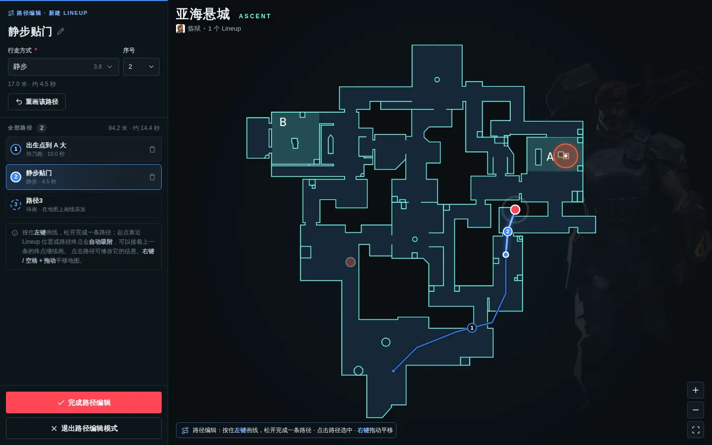
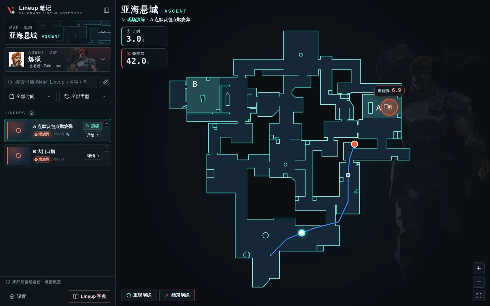

# Lineup 笔记 · 无畏契约点位记录

一个**个人使用**的无畏契约（VALORANT）Lineup 记录与回顾网站：在战术俯瞰图上标记燃烧弹定投、下烟等技巧的位置，配上截图和备注，随时搜索、回顾；还可以记录燃烧弹的落点和走位路线，用「现场演练」按真实移动速度模拟一遍、掐好时间。

- 纯前端网站，**数据只保存在你自己的浏览器里**，不需要服务器、账号或数据库
- 可以直接部署到 GitHub Pages，在电脑或手机上打开
- 界面为中文，深色战术风格，配色与地图保持一致


## 功能一览

| 页面 | 功能 |
| --- | --- |
| **首页** | 左侧可收起的导览栏 + 右侧大地图。导览栏从上到下：地图菜单、英雄菜单、搜索框、筛选（创建时间 / 类型）、搜索结果卡片；底部左侧「设置」、右侧「Lineup 字典」 |
| **地图** | 滚轮 / 双指缩放、拖动平移。圆点 = Lineup 位置：**实心圆点 + 白色外圈，圆心颜色 = 类型颜色**；同一位置有多个 Lineup 时显示为**黑色圆心 + 白色外圈**，中间标出数量 |
| **预览** | 鼠标移到圆点上弹出预览窗口：名字、预览图（点击放大）、「详情」、「相同位置新建」。多个 Lineup 时是可以左右滑动（拖动 / 滚轮 / 箭头）的卡片列表 |
| **新建** | 在地图上**双击**任意位置，就在该处弹出新建面板：名字、类型（可在下拉菜单里直接新建类型并选颜色）、「落点参照」开关、「增加路径追踪」、多张图片（第一张为预览图，可拖动排序，支持 Ctrl+V 粘贴截图）、备注。英雄、地图、位置自动记录 |
| **落点参照** | 打开开关后，地图中间出现落点图案，拖动到落点位置即可；**炼狱**为直径 9 米的半透明红色燃烧弹范围（透过它能看到地图），其他英雄为通用落点标记。可选填「落点时间」（秒） |
| **路径追踪** | 点「增加路径追踪」进入路径编辑，导览栏变成路径编辑面板。在地图上按住左键画线、松开完成一条路径（蓝色线条，终点为蓝色实心 + 白色外圈的圆点），详见下文 |
| **区域搜索** | 搜索框右边的画笔按钮：在地图上圈出一块区域，导览栏列出**落点在圈内**的 Lineup，地图上同时显示它们的落点 |
| **搜索结果** | 点击卡片：地图自动定位到该 Lineup 并弹出预览；「详情」进入详情页；有路径时可「演练」；右上角的「−」小方框**隐藏该 Lineup**（地图和列表中都不再显示，点「已隐藏」恢复） |
| **现场演练** | 搜索结果卡片、地图预览窗口、详情页地图上方的「现场演练」：圆点按行走方式的真实速度沿路径移动，同时显示计时和爆能器倒计时，详见下文 |
| **Lineup 字典** | 顶部英雄 / 地图 / 搜索 / 时间 / 类型筛选，下方像文件管理器「详细信息」视图一样逐行列出：名称、英雄、地图、类型、创建时间，可点击表头排序；右侧预览栏 |
| **详情页** | 编辑名字、类型、英雄、图片、备注；最下方选择地图，并显示该地图上同一英雄的全部 Lineup，**当前 Lineup 为黄色**，拖动黄色圆点即可修改位置。落点（位置、落点时间）、路径（点击地图上的路径编辑、新增、删除）和现场演练也都在这张图里 |
| **设置** | 类型管理（改名、改色、排序、删除并转移）、标记点大小、图片压缩、导出 / 导入备份、存储占用、清空数据 |

### 同一位置的多个 Lineup（黑点）

- 在预览窗口点「相同位置新建」，或者直接**双击已有的圆点**，新 Lineup 会使用完全相同的坐标，自动归入同一个黑点。
- 在详情页里：
  - 当前 Lineup 属于某个黑点时，它显示为**黑色圆心 + 黄色外圈**，按住它拖动即可把当前 Lineup **单独拖出**，其余的留在原处；
  - 拖动黄色圆点**靠近其他圆点**（单个或黑点）时会自动吸附并高亮，松开即**合并到同一位置**；
  - 也可以双击地图把当前 Lineup 直接移过去，或点左下角「移出到附近」。
- 修改位置后记得点右上角「保存」（或 Ctrl+S）。


### 路径追踪

- 新建面板点「**增加路径追踪**」（详情页在地图上方），进入路径编辑：
  - 顶部是当前路径的名称（默认「路径1」「路径2」……），**点击标题可以改名**；
  - 下面选择**行走方式**（持刀跑、静步、持各种武器跑）和**序号**。序号默认按画线顺序，不会重复：改成已被占用的序号时两条路径互换位置；
  - 「**重画该路径**」撤销刚画的路径，编辑框退回上一条路径，接着画的线会放回原来的位置并沿用原来的名称和行走方式；
  - 列表里可以点选任意一条路径修改，或删除。
- 在地图上**按住左键画线，松开即完成一条路径**。起点靠近 Lineup 位置或上一条路径的终点时会**自动吸附**，可以一条接一条地画下去；点击地图上的路径可以选中它。画线时用**右键拖动**或**按住空格拖动**平移地图，滚轮缩放。
- 「**完成路径编辑**」前会检查每条路径都选了行走方式；完成后回到新建面板，原来的按钮位置变成「显示路径」开关和「新增」按钮。「**退出路径编辑模式**」时如果有改动，会询问是否保存。
- 详情页的路径修改和其他修改一样，点右上角「保存」后才写入。



### 现场演练

- 有路径的 Lineup 会出现「**现场演练**」按钮：导览栏的搜索结果卡片（「演练」）、地图上的预览窗口、详情页地图上方。
- 演练时地图上只保留这个 Lineup 相关的图案。**青蓝色外圈的白色圆点**从第 1 条路径的起点出发，按每条路径的行走方式和对应的移动速度，依次走到最后一条路径的终点。
- 地图名称下方显示**计时**（精确到 0.1 秒）和 **45 秒爆能器倒计时**，都在圆点开始移动时开始、到达终点时停止。
- 有落点时，落点上方显示倒计时：先倒数「落点时间」（这时还不显示落点图案），落地后显示燃烧弹范围并倒数 **7.5 秒**持续时间（目前只有炼狱有落点倒计时）。
- 演练结束后保持结束状态；左下角「**重现演练**」重新开始、「**结束演练**」（或 `Esc`）回到演练前的样子。



## 比例尺与移动速度

- **比例尺**：以亚海悬城 B 大厅为参照——两侧墙之间 20 米，在 1065 像素宽的地图图片上约 150 像素，所以整张图宽约 **142 米**，其他地图沿用同一比例。某张地图需要单独校准时，在 `src/data/maps.ts` 里给它加上 `widthMeters`（图片宽度对应的米数）。
- **燃烧弹**：直径 9 米，持续 7.5 秒（`src/data/landing.ts`，以后可以在这里给其他英雄加落点图案）。
- **移动速度**（米 / 秒，`src/data/movement.ts`，游戏更新后直接改数字即可）：持刀跑、静步、持战神 / 奥丁跑为给定数值，其余取自[官方 Wiki](https://wiki.playvalorant.com/en-us/Weapons)。

| 行走方式 | 速度 |
| --- | --- |
| 持刀跑 | 6.75 |
| 持标配 / 狂怒 / 鬼魅跑、持蜂刺 / 骇灵跑 | 5.73 |
| 持短炮 / 追猎 / 正义跑 | 5.4 |
| 持獠犬 / 戍卫 / 幻影 / 狂徒 / 悍狼跑 | 5.4 |
| 持飞将 / 莽侠跑 | 5.4 |
| 持冥驹跑、持战神 / 奥丁跑 | 5.13 |
| 持雄鹿 / 判官跑 | 5.06 |
| 静步（任何武器） | 3.8 |

## 快速开始

需要 [Node.js](https://nodejs.org/) 20.19+ 或 22.12+。

```bash
npm install      # 安装依赖（只需一次）
npm run dev      # 启动开发服务器，浏览器打开 http://localhost:5173
```

其他命令：

```bash
npm run build    # 类型检查 + 打包到 dist/
npm run preview  # 本地预览打包结果
npm test         # 运行单元测试
```

## 部署到 GitHub Pages

仓库里已经带好了自动部署的工作流（`.github/workflows/deploy.yml`）：

1. 打开 GitHub 仓库 → **Settings → Pages**，把 **Source** 设为 **GitHub Actions**（只需设置一次）。
2. 把代码合并 / 推送到 `main` 分支，Actions 会自动测试、打包并发布。
3. 发布完成后访问 `https://<你的用户名>.github.io/<仓库名>/`。

打包产物使用相对路径和 hash 路由（地址形如 `…/#/dict`），放在任何子路径下都能正常打开、刷新不会 404。

## 数据存储与备份（重要）

- 所有 Lineup、类型和图片都保存在**当前浏览器的 IndexedDB** 中，不会上传到任何地方。
- **不同浏览器、不同电脑、不同网址之间的数据互不相通**。例如本地开发时的 `localhost:5173` 和部署后的 GitHub Pages 网址，是两份独立的数据。
- 在「设置 → 数据备份」中可以：
  - **自动备份到文件夹**（推荐，需电脑版 Edge / Chrome）：选择一个本地文件夹后，每次修改都会自动把全部数据打包保存进去，每天一个 `lineup-auto-日期.zip`，保留最近几天；浏览器数据被清掉后，重新选择这个文件夹即可一键恢复；
  - **导出备份**：手动打包成一个 `.zip`（包含全部 Lineup、类型和图片）；
  - **导入备份**：可以与现有数据合并（同名类型会自动合并，不会重复），也可以覆盖现有数据；备份里包含落点和路径，新版导出的备份需要用新版网站导入；
  - 申请**持久化存储**，避免浏览器在磁盘空间不足时自动清理网站数据。
- 详细步骤和各种恢复场景见 **[备份与恢复说明](docs/backup-guide.md)**。
- 清除浏览器的「网站数据 / Cookie」会删除这些数据，操作前请先导出备份。
- 上传的截图默认会压缩为 WebP（最长边 1920px），通常只有原图的十分之一大小，可在设置中关闭或调整。

## 数据模型

在你列出的属性基础上，补充了位置、更新时间等必要字段：

| 字段 | 说明 |
| --- | --- |
| `id` | 唯一标识 |
| `name` | 名字 |
| `createdAt` | 创建时间（createDate），自动记录 |
| `updatedAt` | 最后修改时间（新增） |
| `typeId` | 类型（标签）。**颜色属于类型**：类型 = 名字 + 颜色，修改类型颜色后，该类型的所有 Lineup 一起变色 |
| `agentId` | 英雄，新建时取首页当前选择的英雄 |
| `mapId` | 地图，新建时取首页当前选择的地图 |
| `x`, `y` | 在地图上的位置（新增），以 0–10000 的整数保存（万分比），与图片分辨率无关；坐标完全相同的 Lineup 视为同一位置 |
| `imageIds` | 图片（pic），可以多张，第一张为预览图 |
| `note` | 备注 |
| `landing` | 落点参照（新增）：`{ x, y, delay }`，`delay` 为落点时间（秒，可为空）；未开启时为 `null` |
| `paths` | 路径（新增）：`[{ id, name, mode, points }]`，数组顺序就是序号；`name` 为空时显示「路径 N」，`mode` 为行走方式，`points` 为路径经过的点 |

图片单独存放（原图 + 缩略图），列表和预览窗口只加载缩略图，打开大图时才读取原图。

## 添加新地图 / 新英雄

- **地图**：把俯瞰图放到 `src/assets/maps/<id>.png`，然后在 `src/data/maps.ts` 的列表里加一行，例如 `{ id: 'bind', name: '源工重镇', en: 'Bind' }`。新图片的比例和现有地图不同时，再加上 `widthMeters`（图片宽度对应的游戏内米数），燃烧弹范围和演练速度才准确。
- **英雄**：在 `src/data/agents.ts` 的列表里加一行，并放入头像 `src/assets/agents/avatars/<id>.webp` 和全身像 `src/assets/agents/portraits/<id>.webp`（全身像可选，支持 png / jpg / webp）。

已有地图图片的外部区域做了透明处理；新图片不处理也可以正常使用。

## 项目结构

```
src/
├─ data/            地图（含比例尺）、英雄、行走方式与速度、落点图案配置
├─ db/              IndexedDB 读写、备份导入导出
├─ stores/          Pinia 状态：Lineup 与类型、偏好设置、界面状态
├─ lib/             纯函数：坐标分组与吸附、搜索筛选（含区域搜索）、几何计算、演练时间线、图片压缩、浮层定位
├─ composables/     组合式函数：图片地址、浮层栈（Esc 关闭）、预览窗口开关、路径编辑、画线、现场演练
├─ components/
│  ├─ map/          地图画布（缩放平移、画笔）、标记点、预览窗口、路径 / 落点 / 圈选图层、演练计时
│  ├─ lineup/       新建面板、图片管理、位置编辑、路径编辑面板、卡片
│  ├─ home/         首页导览栏
│  ├─ settings/     设置弹窗
│  └─ common/       下拉菜单、英雄 / 地图 / 类型选择、弹窗、提示、图片查看器
└─ views/           首页、Lineup 字典、详情页
tests/              单元测试（Vitest）
```

技术栈：Vue 3 + TypeScript + Vite，Pinia，Vue Router（hash 模式），idb（IndexedDB），fflate（zip 备份）。

## 快捷操作

| 操作 | 作用 |
| --- | --- |
| 双击地图 | 在该位置新建 Lineup |
| 双击圆点 | 在相同位置新建 Lineup |
| 滚轮 / 双指 | 缩放地图（详情页中需按住 Ctrl，避免滚动页面时误缩放） |
| 画路径 / 圈选时：右键拖动、按住空格拖动 | 平移地图（左键用来画线） |
| `/` | 聚焦首页搜索框 |
| `Ctrl` + `V` | 在新建面板或详情页粘贴截图 |
| `Ctrl` + `Enter` | 保存新建的 Lineup |
| `Ctrl` + `S` | 保存详情页的修改 |
| `Esc` | 关闭弹窗 / 预览；取消圈选、退出路径编辑、结束现场演练 |

---

本项目仅供个人学习与记录使用，与 Riot Games 无关。游戏名称、地图与英雄图片的版权归 Riot Games 所有。
